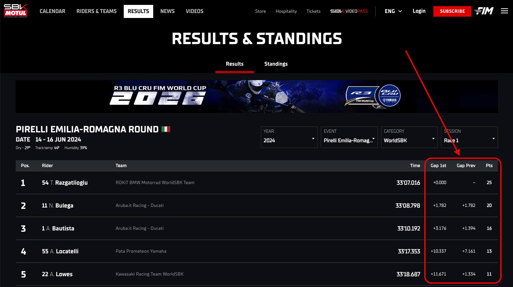

# WorldSBK Results+

An unofficial browser extension that enhances results pages on [worldsbk.com](https://www.worldsbk.com): it adds **gap** columns (to the leader and to the rider ahead), **championship points** on race sessions, and quick access to the official **Results** and **Standings** PDFs — so you can read a session at a glance instead of doing the subtraction in your head.



## What it does

WorldSBK results tables list each rider's lap/race time but not the gaps. This extension parses those times and injects two cells right after the time column:

- **Gap 1st** — difference to the session/race leader
- **Gap Prev** — difference to the rider immediately ahead

It works on two table layouts:

- **Practice / qualifying** tables, where every row shows an absolute lap time (`1'32.733`)
- **Race** tables, where P1 shows a full time and everyone else shows `+gap` — the extension reconstructs each absolute time (`leader + gap`) so both columns stay correct

### Championship points (race sessions only)

When the selected session is a race, a **Pts** column is added with the points each rider scored, based on finishing position. The session is identified from the URL's session code (`001` = Race 1, `002` = Superpole Race, `003` = Race 2), and the correct scale is chosen automatically:

- **Race 1 / Race 2** — full scale, top 15 score: `25, 20, 16, 13, 11, 10, 9, 8, 7, 6, 5, 4, 3, 2, 1`
- **Superpole Race** — sprint scale, top 9 score: `12, 10, 9, 7, 6, 5, 4, 3, 2`

Practice and qualifying sessions get no points column. Unclassified riders (DNF/DNS) show `–`.

### Official PDFs (Results & Standings)

Below the results widget, the extension appends a PDF panel for the page you're on, and a smooth-scroll "jump" link just above the results that animates down to it. The **Results** PDF is offered on every session; the **Championship Standings** PDF is added only on race sessions (where it exists), shown as a second tab. URLs come from the links the site already provides when present, otherwise they're built from the page's path segments (year / event / category / session) plus a fixed tail (`CLA/Results.pdf`, `STD/ChampionshipStandings.pdf`). PDFs embed inline where the browser allows it, and fall back to an "open in new tab" link when inline embedding is blocked.

## Install (Chrome / Edge / Brave)

Until it's on the Chrome Web Store, load it unpacked:

1. Download or clone this repo
2. Go to `chrome://extensions`
3. Enable **Developer mode** (top right)
4. Click **Load unpacked** and select this folder
5. Open any WorldSBK results page and reload

## Install (Safari)

Safari supports the same Web Extension format, but distribution goes through a native app wrapper. On a Mac with Xcode:

```bash
xcrun safari-web-extension-converter /path/to/this/folder
```

Then build the generated project in Xcode. For local testing, enable **Allow unsigned extensions** in Safari's Develop menu. Publishing to the App Store requires the Apple Developer Program.

## How it works

- A content script (`content.js`) runs on `worldsbk.com` pages.
- Lap times are parsed from the `M'SS.mmm` (or `+gap`) format into seconds, gaps are computed, and two cells are appended per row.
- Injected cells are tagged with a class and **cleared/rebuilt on every run**, so the script is idempotent across lazy-loads, live-timing updates, and SPA navigation.
- A debounced `MutationObserver` (disconnected during its own edits to avoid a feedback loop) catches the site's lazy rendering.
- Unparseable values (`DNF`, `+1 Lap`, blanks) render as `–` and don't corrupt the running gap references.

No permissions are requested beyond a content-script match on a single domain. The extension reads the page DOM only and stores nothing.

## Development

Icons are generated from a small script:

```bash
pip install pillow
python scripts/make_icons.py
```

This writes `icon16/32/48/128.png` from a single master design.

## License

[MIT](LICENSE)
